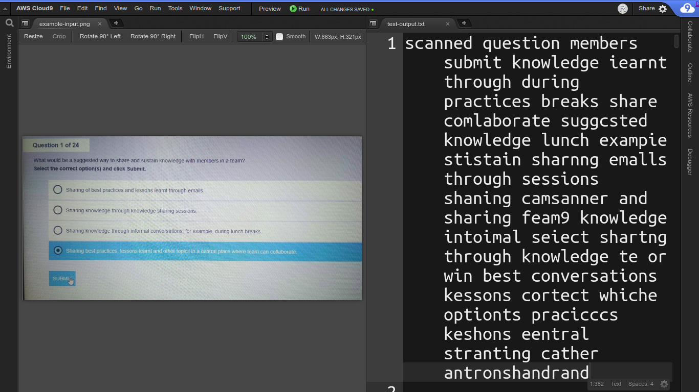

# :notebook: noteworthy

Edge application that converts written notes from a PDF into text.

### :repeat: Example Input and Output
The set of images below show an input-output situation.
- **Left**: The first page of the PDF from which text will be extracted.
- **Right**: The extracted text of the first page




## :zap: Quick Usage
```sh
git clone https://github.com/rafi007akhtar/noteworthy.git
cd noteworthy
chmod a+x install_dependencies.sh
sh install_dependencies.sh
source /opt/intel/openvino/bin/setupvars.sh
python3 app.py
```

## :black_square_button: Dependencies

1. [Python 3.x](https://www.python.org/) and [pip3](https://pip.pypa.io/en/stable/)
2. [OpenVINO toolkit](https://software.intel.com/en-us/openvino-toolkit/choose-download?)
3. Python libraries:
    - [OpenCV](https://opencv.org/)
    - [Numpy](https://numpy.org/)
    - [Poppler](https://pypi.org/project/python-poppler-qt5/)
    - [Pdf2Image](https://pypi.org/project/pdf2image/)

> **Important.** This project straight-up assumes you have OpenVINO toolkit installed in your device. If not, please install by going to [this](https://software.intel.com/en-us/openvino-toolkit/choose-download?) link it before proceeding further with the instructions.

## :ballot_box_with_check: Installation
1. Clone this repository, and enter into it.
    ```sh
    git clone https://github.com/rafi007akhtar/noteworthy.git
    cd noteworthy
    ```
2. Install dependencies.
    ```sh
    # Remember, this will NOT install OpenVINO. OpenVINO is assumed to be already installed
    chmod a+x install_dependencies.sh
    sh install_dependencies.sh
    ```
3. Initialize the environment variables
    > **Important.** Steps 1 and 2 need to be performed only once, whereas this step needs to be performed on every new session

    ```sh
    source /opt/intel/openvino/bin/setupvars.sh
    ```

## :runner: Execution
_Run_ the following command
```sh
python3 app.py
```
That's it! It's that simple.

Now view the output in the default output file, [outputs/notes.txt](outputs/notes.txt)

## :floppy_disk: User Settings and Configurations
Please note that this program takes in **NO** command-line arguments.

Instead, all options that a user might want to set has to be set through the JSON file [options.json](options.json).

It looks like this on installation.
```json
{
    "input": "input.pdf",
    "output": "outputs/notes.txt",
    
    "detector_model_xml": "models/intel/text-spotting-0001-detector/FP32/text-spotting-0001-detector.xml",
    "encoder_model_xml": "models/intel/text-spotting-0001-recognizer-encoder/FP32/text-spotting-0001-recognizer-encoder.xml",
    "decoder_model_xml": "models/intel/text-spotting-0001-recognizer-decoder/FP32/text-spotting-0001-recognizer-decoder.xml",
    
    "probability_threshold": "0.5",
    "alphabet": "  0123456789abcdefghijklmnopqrstuvwxyz",
    
    "CPU_extenstion_path": "",
    "device_name": "CPU",
    "jpegopt": {
        "quality": "100",
        "progressive": "True",
        "optimize": "True"
    }
}
```

Let us see what each of these means. Note that the ones marked with exclamations :exclamation: are **mandatory**, meaning that they must **NOT** be left blank!

1. `inputs`. :exclamation: Path to the input PDF file that needs to be converted
2. `output`. :exclamation: Specifies where and to which file will the output text be dumped.
3. `detector_model_xml`. :exclamation: Path to where the Text Detector model has been downloaded.
4. `encoder_model_xml`. :exclamation: Path to where the Text Encoder model has been downloaded.
5. `decoder_model_xml`. :exclamation: Path to where the Text Detector model has been saved.
6. `probability_threshold`. :exclamation: The probability (between 0 and 1) for the confidence threshold. The output classes with scores more than this value will be retained, and the rest shall be filtered out.
7. `alphabet`. :exclamation: The set of characters that will be used for inference. **Please do NOT change this unless you really know what you are doing.**
8. `CPU_extenstion_path`. Path to the CPU extension, if any.
9. `device_name`. The device on which inference will be performed. Can be one among `CPU`, `GPU`, `FPGA`, `HHDL`, and `MYRIAD`.
10. `jpegopt`. The quality of the images obtained from each page of the PDF. Higher quality means better accuracy but also requires more time.

## :chart_with_upwards_trend: Areas for Improvement
The following contains areas where I believe the project needs to improve. While I have suggested some techiques for doing so in some of the points, I myself could not do the same due to lack of time. If you think you can improve this project on these points, please consider checking out [CONTRIBUTING.md](CONTRIBUTING.md) and contribute to this repo!

- **Accuracy.** As you might have seen in the example above, the translated text lacks in accuracy. This is probably because of the models chosen. A better option would be finding a model with higher accuracy, converting it with the Model Optimizer, and feeding it to the program.
- **Time complexity.** A PDF file with 6 pages of handwritten texts needs about a minute to get translated with 100% qualtiy setting. That's long! The project needs to be optimized for time, and one way to do it is by introducing multithreading and / or asynchronous inference.
- **Space complexity.** The environment on which I have worked on constantly gave me warning that I was running out of storage while executing the run file (granted, it was a limited-memory environment). The project needs to be optimized for memory as well.

