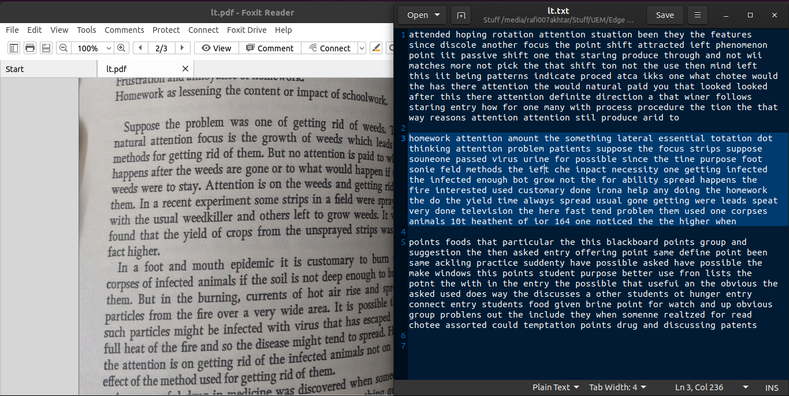

# :pencil: noteworthy

Edge application that converts written notes from a PDF into text.

## :zap: Quick Usage
```sh
git clone https://github.com/rafi007akhtar/noteworthy.git
cd noteworthy
sh install_dependencies.sh
source /opt/intel/openvino/bin/setupvars.sh
python3 app.py
```

## :bulb: Basic Idea behind Noteworthy

This app:
- takes a PDF document as the input,
- goes through all the pages of the PDF,
- extracts text from all pages, and
- dumps the texts into a text file that you can later refer to as notes.

### :repeat: Example Input and Output
The set of images below show an input-output situation.
- **Input (left)**: The first page of the PDF from which text will be extracted. This input is provided in the [options.json](options.json) file as value to the `input` key.
- **Output (right)**: The extracted text of the first page. The text file is stored in the path and name specified in the [options.json](options.json) file as value to the `output` key.



(More on the [options.json](options.json) file down below.)


## :black_square_button: Dependencies

1. [Python 3.x](https://www.python.org/) and [pip3](https://pip.pypa.io/en/stable/)
2. [OpenVINO toolkit](https://software.intel.com/en-us/openvino-toolkit/choose-download?)
3. Python libraries:
    - [OpenCV](https://opencv.org/)
    - [Numpy](https://numpy.org/)
    - [Poppler](https://pypi.org/project/python-poppler-qt5/)
    - [Pdf2Image](https://pypi.org/project/pdf2image/)

>:warning: **Important.** This project straight-up assumes that you have the OpenVINO toolkit installed in your device. If not, please install by going to [this](https://software.intel.com/en-us/openvino-toolkit/choose-download?) link it before proceeding any further with the instructions.

## :ballot_box_with_check: Installation
1. Clone this repository, and enter into it.
    ```sh
    git clone https://github.com/rafi007akhtar/noteworthy.git
    cd noteworthy
    ```
2. If you're using a Debian-based Linux environment, enter the below command to install the Python-based dependencies, as mentioned in point #3 of [Dependencies](#black_square_button-dependencies).
    ```sh
    sh install_dependencies.sh
    ```
    If you're using any other environment, though, install the mentioned dependencies manually, based on your OS.
3. Initialize the environment variables
    ```sh
    source /opt/intel/openvino/bin/setupvars.sh
    ```
     >:warning: **Important.** Steps 1 and 2 need to be performed only once, whereas this step needs to be performed on every new session.

## :open_file_folder: Project Structure

On installation, you will get the following files:
- **[app.py](app.py)**. The main Python program that you need to run this project (instructions [below](#runner-execution)).
- **[options.json](options.json)**. The JSON file that houses all the user configuration and settings for the project. This is the file you will be interacting with the most, as the input PDF and output text file are specified here. Description of each option is given [below](#floppy_disk-user-settings-and-configurations).
- **[install_dependencies.sh](install_dependencies.sh)**. This file is used for installing all **Python-based dependencies**, meaning all the Python libraries mentioned in point #3 of [Dependencies](#black_square_button-dependencies) can be installed with this file. Please do **NOT** change anything in this file (unless you are trying to [contribute](CONTRIBUTING.md) to this repo).
- **[pdffed.py](pdffed.py)**. A helper file that helps [app.py](app.py) for handling PDFs. You will not have to worry about this file. Please do **NOT** change anything in this file (unless you are trying to [contribute](CONTRIBUTING.md) to this repo).

Apart from these, you also get the following directories.
- **[inputs](inputs/)**. The default directory to house all your input PDF files. You can change it by specifying your value to the `input` key in the [options.json](options.json) file.
- **[outputs](outputs/)**. The default output directory, also changeable by specifying value to the `output` key in the [options.json](options.json) file.
- **[models](models/)**. Contains all the models needed for this project, and more. The models I used for this project are as follows. All of these are pre-trained models available in the [OpenVINO Model Zoo](http://docs.openvinotoolkit.org/latest/_models_intel_index.html) of Pre-trained Models.
    1. [text-spotting-0001-detector](http://docs.openvinotoolkit.org/latest/_models_intel_text_spotting_0001_detector_description_text_spotting_0001_detector.html)
    2. [text-spotting-0001-recognizer-encoder](http://docs.openvinotoolkit.org/latest/_models_intel_text_spotting_0001_recognizer_encoder_description_text_spotting_0001_recognizer_encoder.html)
    3. [text-spotting-0001-recognizer-decoder](http://docs.openvinotoolkit.org/latest/_models_intel_text_spotting_0001_recognizer_decoder_description_text_spotting_0001_recognizer_decoder.html)

## :runner: Execution
_Run_ the following command.
```sh
python3 app.py
```
That's it! It's that simple.

The above command takes the input PDF file and the desired output text file from [options.json](options.json). It then converts the PDF into text, and dumps all them all onto the output text file.

### :phone: Troubleshooting
It is possible you might run into the following error.
```
Traceback (most recent call last):
  File "app.py", line 6, in <module>
    from openvino.inference_engine import IECore, IENetwork
ModuleNotFoundError: No module named 'openvino'
```
It means the environment varaibles are not initialized in current session. Intialize them by running the following command.
```sh
source /opt/intel/openvino/bin/setupvars.sh
```


## :floppy_disk: User Settings and Configurations
Please note that this program takes in **NO** command-line arguments.

Instead, all options that a user might want to set has to be set through the JSON file [options.json](options.json).

It looks like this on installation.
```json
{
    "input": "inputs/input.pdf",
    "output": "outputs/notes.txt",
    
    "detector_model_xml": "models/intel/text-spotting-0001-detector/FP16/text-spotting-0001-detector.xml",
    "encoder_model_xml": "models/intel/text-spotting-0001-recognizer-encoder/FP16/text-spotting-0001-recognizer-encoder.xml",
    "decoder_model_xml": "models/intel/text-spotting-0001-recognizer-decoder/FP16/text-spotting-0001-recognizer-decoder.xml",
    
    "probability_threshold": "0.5",
    "alphabet": "  0123456789abcdefghijklmnopqrstuvwxyz",
    
    "CPU_extenstion_path": "",
    "device_name": "CPU",
    "jpegopt": {
        "quality": "50",
        "progressive": "True",
        "optimize": "True"
    }
}
```

Let us see what each of these means. 
>:warning: **Note.** The keys marked with exclamations :exclamation: are **mandatory**, meaning that their values must **NOT** be left blank!

1. :exclamation: `input`. Path to the input PDF file that needs to be converted
2. :exclamation: `output`. Specifies where and to which file will the output text be dumped.
3. :exclamation: `detector_model_xml`. Path to where the [Text Detector](http://docs.openvinotoolkit.org/latest/_models_intel_text_spotting_0001_detector_description_text_spotting_0001_detector.html) model has been downloaded.
4. :exclamation: `encoder_model_xml`. Path to where the [Text Encoder](http://docs.openvinotoolkit.org/latest/_models_intel_text_spotting_0001_recognizer_decoder_description_text_spotting_0001_recognizer_decoder.html) model has been downloaded.
5. :exclamation: `decoder_model_xml`. Path to where the [Text Decoder](http://docs.openvinotoolkit.org/latest/_models_intel_text_spotting_0001_recognizer_decoder_description_text_spotting_0001_recognizer_decoder.html) model has been downloaded.
6. :exclamation: `probability_threshold`. The probability (between 0 and 1) for the confidence threshold. The output classes with scores more than this value will be retained, and the rest shall be filtered out.
7. :exclamation: `alphabet`. The set of characters that will be used for inference. **Please do NOT change this unless you really know what you are doing.**
8. `CPU_extenstion_path`. Path to the CPU extension, if any.
9. :exclamation: `device_name`. The device on which inference will be performed. Can be one among `CPU`, `GPU`, `FPGA`, `HHDL`, and `MYRIAD`.
10. `jpegopt`. The quality of the images obtained from each page of the PDF. Higher quality might result in better accuracy but would also require more time. Allowed range is between [0, 100], and has to be a whole number.

## :chart_with_upwards_trend: Areas for Improvement
The following contains areas where I believe the project needs to improve. While I have suggested some techiques for doing so in some of the points, I myself could not do the same due to lack of time. If you think you can improve this project on these points, please consider checking out [CONTRIBUTING.md](CONTRIBUTING.md) and contribute to this repo!

- **Accuracy.** As you might have seen in the [example above](#repeat-example-input-and-output), the translated text lacks in accuracy. This is probably because of the models chosen. A better option would be finding a model with higher accuracy, converting it with the Model Optimizer, and feeding it to the program.
- **Time complexity.** A PDF file with 6 pages of handwritten texts needs about a minute to get translated with 100% quality setting. That's long! The project needs to be optimized for time, and one way to do it is by introducing multithreading and / or asynchronous inference.
- **Space complexity.** The environment on which I have worked on constantly gave me warning that I was running out of storage while executing the run file (granted, it was a limited-memory environment). The project needs to be optimized for memory as well.

## License
[MIT License](LICENSE)
